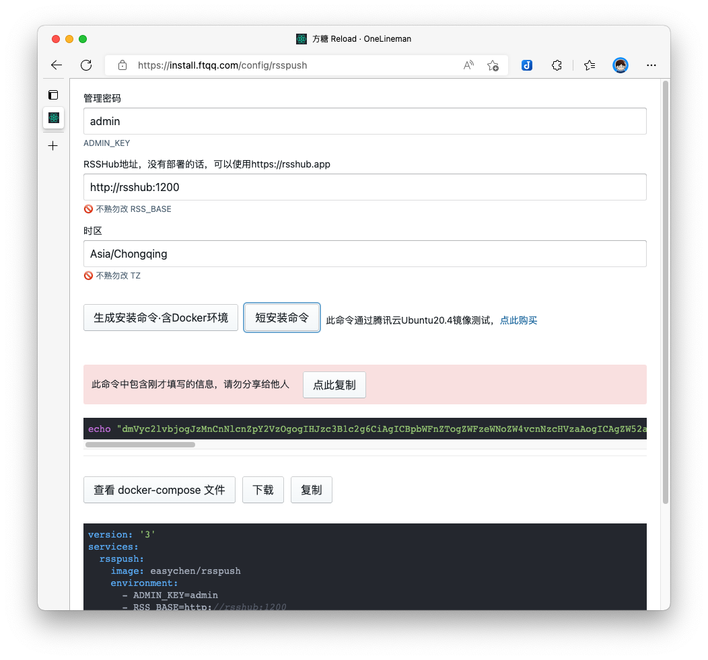
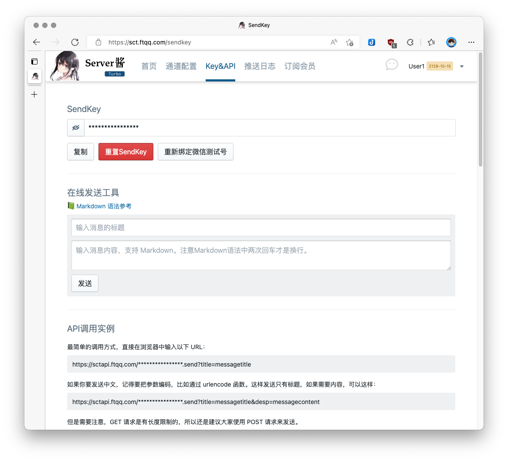
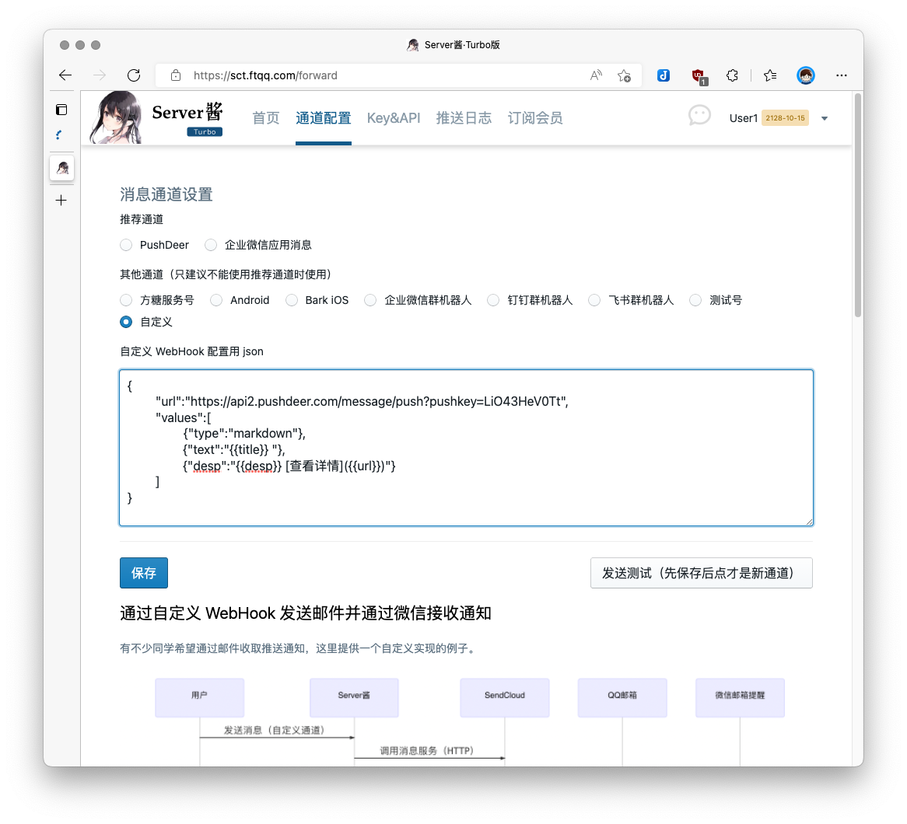
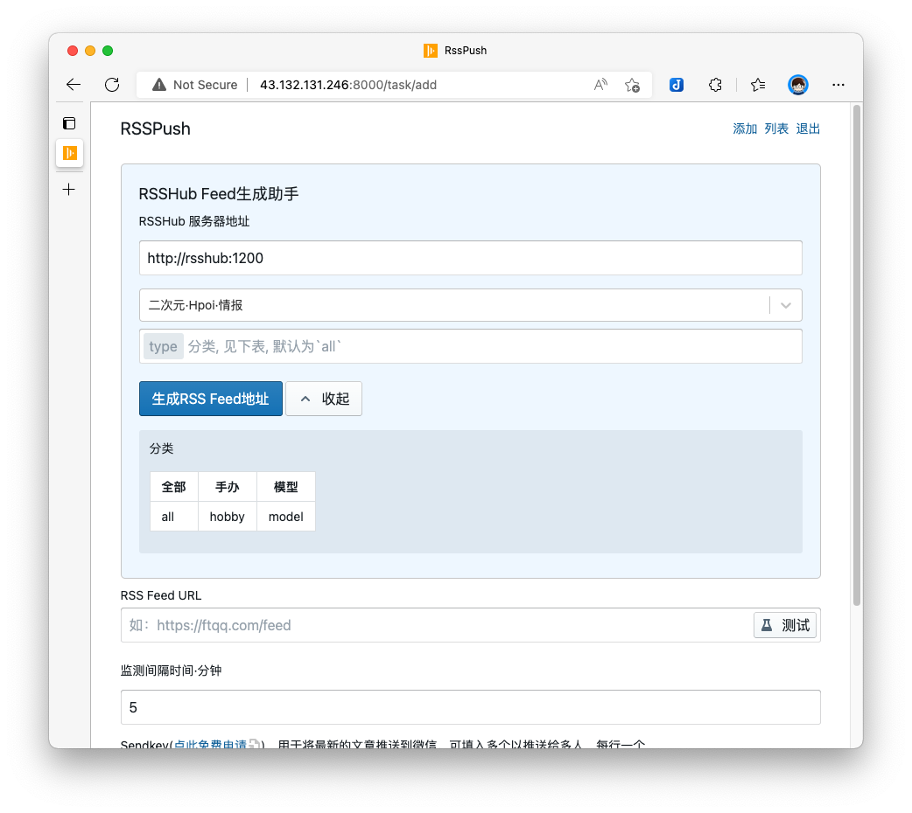

# RSSPush

RSSPush 是一款 Web 应用，它可以监测RSS变动，并发送最新内容到微信

## 界面截图

### 登入
  

### 添加RSS源

  

### 管理RSS源

  

### 通过RSSHub工具搜索和选择两千多个RSS源

  

## 安装

RSSPush 采用 Docker 方式部署应用，并提供一键安装命令生成界面。

### 环境要求

RSSPush 需要 x86/arm64 架构的 Docker环境，请预先安装好 Docker 和 Docker-compose。如果你使用[腾讯云的Ubuntu18.04/20.04](https://curl.qcloud.com/VPjlS4gj) 也可以通过一键安装命令来自动安装。

### 生成安装命令

点这里进入[命令生成界面](https://install.ftqq.com/config/rsspush)

  

在管理密码一栏，输入你想要设置的密码。然后：

1. 点击「短安装命令」，会生成一个简版命令，此命令在服务器上创建一个`docker-compose.yml`文件，并通过`docker-compose`命令启动它
1. 点击「生成安装命令·含Docker环境」，则除了「短安装命令」的内容，还会包含（在Ubuntu上）安装Docker和Docker-compose的命令

如果你在其他系统上安装，可以通过「查看、下载、复制 docker-compose 文件」，然后再运行 `docker-compose` 命令来手工安装。

### 运行安装命令

进入云服务器的命令行（ [教程](https://www.bilibili.com/video/BV1kU4y1j73Q) ），粘贴上边复制的命令，按回车即可。

## 配置

你可以通过环境变量对镜像做进一步配置。

```yml
version: '3'
services:
  rsspush:
    image: easychen/rsspush
    volumes:
      - "./data:/rsspush/api/data"
    environment:
      - ADMIN_KEY=admin
      - RSS_BASE=http://rsshub:1200
      - TZ=Asia/Chongqing
    ports:
      - 8000:8000
  rsshub:
    image: diygod/rsshub
    ports:
      - 1200:1200
```

你可以通过 `ADMIN_KEY`(管理密码)，`RSS_BASE`（RSSHUB工具中默认的服务器地址）对RSSPush进行调整。

默认情况下，docker-compose命令还部署了一个本地RSSHub（一个包含两千多个订阅源的RSS工具），以方便大家使用。

你亦可以通过 RSSHub 的环境变量对实例进行调整，可参考[这个文档](https://docs.rsshub.app/install/#pei-zhi-wang-luo-pei-zhi)🪜。

```yml
version: '3'
services:
  rsspush:
    image: easychen/rsspush
    volumes:
      - "./data:/rsspush/api/data"
    environment:
      - ADMIN_KEY=admin
      - RSS_BASE=http://rsshub.app
      - TZ=Asia/Chongqing
    ports:
      - 8000:8000
  rsshub:
    image: diygod/rsshub
    ports:
      - 1200:1200
    environment:
      - CACHE_TYPE=memory
```

如果你不使用RSSHub或者使用RSSHub官方的服务器，可以注释掉rsshub部分的内容，这样将不会本地启用RSSHub。

```yml
version: '3'
services:
  rsspush:
    image: easychen/rsspush
    volumes:
      - "./data:/rsspush/api/data"
    environment:
      - ADMIN_KEY=admin
      - RSS_BASE=http://rsshub.app
      - TZ=Asia/Chongqing
    ports:
      - 8000:8000
#   rsshub:
#     image: diygod/rsshub
#     ports:
#       - 1200:1200
#     environment:
#       - CACHE_TYPE=memory
```
## 使用

### 登入

`docker-compose`命令正确启动以后，请访问 `${服务器公网IP}:8000` 进入管理界面。

> 如果访问不了，有两种情况 ① 服务启动需要时间，可多等几分钟再试 ② 服务器防火墙配置没有放开8000端口，请手工放开8000端口

输入在 `docker-compose.yml` 中指定的管理密码( ADMIN_KEY )，即可进入。

### 添加任务

点击右上角导航菜单中的 `添加` 进入任务添加界面.

  

只有三个值需要我们确认：

1. Feed URL：RSS地址，输入后可以点击后边的「测试」按钮，查看服务器能够抓取到Feed内容。有时候因为机房网络问题，在你电脑上可以获取到的Feed，在机房不一定能获取到。
1. 监测间隔时间：每隔多久监测一次，默认是60分钟。如果希望每分钟都监测，可以填0。
1. SendKey：RSSPush使用[Server酱](https://sct.ftqq.com?fr=rsshub)将监测到的内容推送到微信，因此我们需要申请一个Sendkey。

#### 如何获得 SendKey

登录[Server酱官网](https://sct.ftqq.com?fr=rsshub)，进入「[Key&API](https://sct.ftqq.com/sendkey)」，点击「复制」按钮即可。

  

##### 如何推送到其他通道

登录[Server酱官网](https://sct.ftqq.com?fr=rsshub)，进入「[通道配置](https://sct.ftqq.com/forward)」，选择要推送的通道，并按页面上的说明进行配置。可以将消息推送到「PushDeer」和各种群机器人。

  

如果以上通道不能满足你的需要，可以选择「自定义」通道，发送自定义的http请求。此方式可以兼容绝大部分通知接口。

 

注意每一个微信账户可以绑定一个Sendkey。如果你想要把监测到的RSS更新推送给多人，那么可以让他们到[Server酱官网](https://sct.ftqq.com?fr=rsshub)生成Sendkey，然后交给你填入这里，多个Sendkey一行填一个。

 

### 使用RSSHub Feed生成助手

RSSHub是一个包含了两千多个订阅源的RSS工具，为了方便大家添加有用的RSS源，我们整理了它的文档，并制作了一个可以搜索和选择，按提示填写参数后可以自动生成最终Feed的小工具。

默认情况下，这个工具是关闭的，可以点击「展开RSSHub工具」按钮启用。

  

然后我们就可以看到小工具的界面了。

 

点击「请选择」下拉框，向下滚动鼠标，可以浏览两千多个信息源；同时，你也可以直接输入关键字，比如「漫画」、「图片」等，下拉菜单会自动只显示匹配的选项。

选中你需要的RSS源以后，一些支持参数的源会显示参数和提示，可以按提示填入参数。

  

比如图中如果我们关心的是`手办`分类，那么就在有`type`字样开头的输入框中输入hobby，然后点击「生成RSS Feed地址」。工具会帮我们自动生成Feed地址，并填入下边的RSS Feed URL输入框中。

#### RSSHub 服务器地址

如果你在 `docker-compose.yml` 中启动了本地RSSHub服务，那么「RSSHub服务器地址」无需修改（ http://rsshub:1200 ）；如果你没有启动本地服务，那么可以填入其他RSSHub服务器的地址，比如官方的`https://rsshub.app`🪜。

### 管理任务

点击右上角导航中的「列表」，可以对已经添加的RSS源进行管理：

 


## 运行数据

在运行 `docker-compose` 命令的同级目录，会创建一个 `data` 子目录，其中包含任务清单 `tasks.json` 和定时任务日志 `cron.txt`，可用于数据导入导出和任务状态确认。


 

